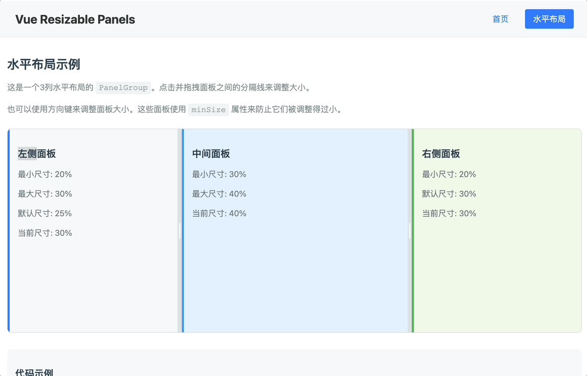

# vue-resizable-panels



A Vue 3 implementation based on react-resizable-panels (version 2.1.9)

## Usage

Package: `vue-resizable-panels`

### Building the Package

1. `pnpm build` - Build the package
2. `pnpm pack` - Create .tgz file for distribution

---

## Demo: vue-resizable-panels-website

### Setup Instructions

1. **Install from local .tgz file**: Add the dependency to your project's package.json

```json
"dependencies": {
    "vue-resizable-panels": "file:../vue-resizable-panels/vue-resizable-panels-1.0.0.tgz"
}
```

2. **Install dependencies**: `pnpm i`
3. **Run development server**: `pnpm dev`
